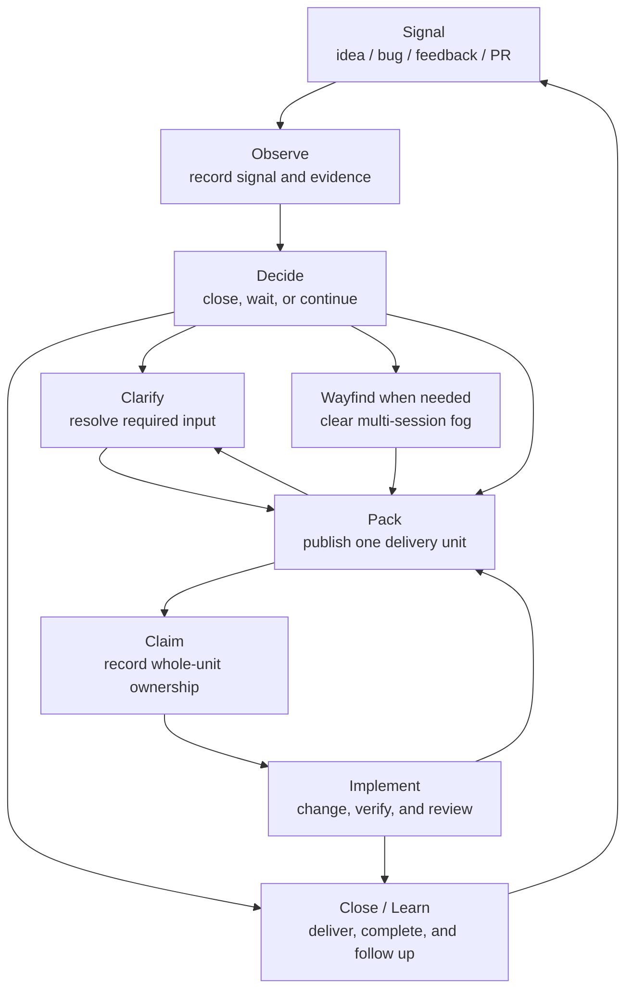

# AI-Native Development: Delivery Loop

## Purpose

AI-native development turns ambiguous signals into verified software changes.

Once Agents can execute quickly, the main risk is no longer that nobody writes code. The larger risk is writing the wrong thing quickly and confidently. The AND delivery loop controls that risk by reducing uncertainty before and during implementation.

## The Problem

Most software work begins as a signal rather than a defined delivery unit:

- an idea;
- a bug report;
- user feedback;
- a screenshot or error message;
- a product judgment;
- an external pull request;
- an unfinished design.

Those signals mix facts, value judgments, business rules, implementation risk, dependencies, and acceptance criteria. Jumping straight to implementation amplifies three failures:

- **Wrong problem**: building something that is not worth doing, is already done, or points in the wrong direction.
- **Wrong boundary**: making the work too large, too small, incorrectly split, or blind to real dependencies.
- **Wrong completion standard**: changing code without a way to prove it satisfies the need.

The loop separates these uncertainties so each is resolved by the right participant at the right time.

## Core Loop

```text
Observe -> Decide -> Clarify -> Pack -> Claim -> Implement -> Close/Learn
```

| Stage | Question | Main result |
| --- | --- | --- |
| Observe | What signal arrived, and what is already known? | A durable work record with source evidence. |
| Decide | Is this worth acting on, and what is missing? | Closure, a specific wait, or a route to packaging. |
| Clarify | Which decision, fact, permission, acceptance input, or external event blocks a correct package? | Confirmed input or one explicit unresolved question. |
| Pack | What complete delivery unit can an Agent execute? | A single issue package or PRD package. |
| Claim | Who owns the whole delivery unit? | One recorded owner and an unchanged scope. |
| Implement | What change satisfies the package? | An isolated, verified, and reviewed implementation. |
| Close/Learn | What proves completion, and what follows from it? | A lifecycle outcome, completion evidence, and any new signal. |

This is a loop rather than a one-way assembly line. A later stage can reveal that an earlier assumption was wrong, but the correction returns to the stage that owns it. Packaging does not improvise a missing product decision, and implementation does not privately rewrite the package.

Wayfinding is a conditional on-ramp before Pack, not another mandatory stage. Use it when the destination is visible but the questions required to reach it cannot yet be enumerated in one session. It clears that fog as a shared investigation map; ordinary work still follows Clarify or goes directly to Pack.

## Human And Agent Collaboration

Humans should not be the bottleneck for facts an Agent can verify. Agents should not silently make decisions that require human authority.

| Participant | Owns |
| --- | --- |
| Human | Value judgments, business tradeoffs, authorization, acceptance, merge, rejection, and risk acceptance. |
| Agent | Fact-finding, reproduction, synthesis, packaging, implementation, verification, and consistency checks. |
| Workflow state backend | Durable work, investigation maps, decisions, package contracts, relationships, ownership, and completion evidence. |

The collaboration follows a few practical rules:

- Agents investigate code, tests, logs, docs, and existing workflow state before asking for facts.
- Human decisions happen once at the stage that needs them; downstream work consumes the recorded result.
- Requirements and acceptance live in the configured workflow state backend. Chat reports what happened and what comes next instead of becoming a second specification.
- A stage that lacks its preconditions returns the work to the stage that owns the missing input.

## End-To-End Flow



Clarification is conditional. Work that already contains every required input can move from Decide to Pack. Work that is duplicate, complete, rejected, or no longer relevant can close without entering implementation.

Wayfinding is also conditional. Its map and investigations are planning records, not delivery units: they cannot be picked or claimed for implementation. Once the map is clear, Pack publishes a separate delivery unit and keeps the completed map as linked planning evidence.

## Delivery Units

Implementation begins from one delivery unit with a complete behavioral contract and verification path:

- A **single issue package** carries the complete contract in one work record.
- A **PRD package** carries the complete contract on a parent plus child slices for internal progress, ordering, delegation, and acceptance tracking.

Both shapes require the same contract strength. The difference is whether child slices help execute and verify the work.

A PRD package is still claimed as one unit. Its owner may delegate child slices, but remains responsible for integration, verification, and closure. Containment describes package structure; dependency describes execution order. Neither replaces ownership of the complete delivery unit.

## Durable Handoffs

The configured workflow state backend is the source of truth for the loop. It keeps the current work record, Wayfinding map when any, State Reason, Package Contract, relationships, owner, and evidence recoverable when sessions or Agents change.

Before implementation, work moves through a small queue: `needs-triage`, `needs-info`, `needs-pack`, and `ready-for-agent`. These states describe where pre-execution uncertainty remains; they are not implementation progress states. The [backend contract](../and-backend-contract/backend-contract.md) defines their backend-neutral meaning and invariants; the configured [backend reference](../and-backend-contract/backends/) defines their representation.

Branches, commits, pull requests, CI, and reviews are implementation artifacts. They provide evidence about delivery, while the workflow backend continues to hold the package, ownership, and lifecycle outcome.

Each stage leaves only the durable evidence needed to continue the work. Temporary reasoning and interview transcripts stay out of long-lived state unless they become a decision, blocker, requirement, or completion result.

## Feedback And Completion

The loop preserves correctness by making route-backs explicit:

- A missing decision, fact, permission, acceptance input, or external event returns to Clarify and its accountable owner.
- A weak or incorrect delivery boundary returns to Pack.
- Contradictory or stale workflow state is repaired before claim or implementation.
- Failed implementation verification returns to Implement unless it exposes a package defect.
- A completed, duplicate, rejected, or superseded delivery unit receives a terminal lifecycle outcome with evidence.

For a reviewed implementation with no pending acceptance or blocker, `and-finish` is the Close/Learn action. It delivers the implementation through one authorized GitHub pull request, makes completion authoritative in the configured backend, and then cleans proven-safe delivery artifacts. Review remains part of implementation evidence rather than being rerun during finish.

Closure can produce a new signal: a follow-up requirement, a documentation need, a newly discovered bug, or a lesson that changes future packages. That signal starts another loop instead of quietly expanding the completed delivery unit.

## Continue Reading

- Use the [skills guide](skills.md) to choose the next workflow skill.
- Use the [backend contract](../and-backend-contract/backend-contract.md) for workflow-state concepts and invariants.
- Use the configured [backend reference](../and-backend-contract/backends/) for representation and operations.
- Read the [Wayfinding records ADR](adr/0001-separate-wayfinding-records-from-delivery-units.md) for the map-to-package boundary.
