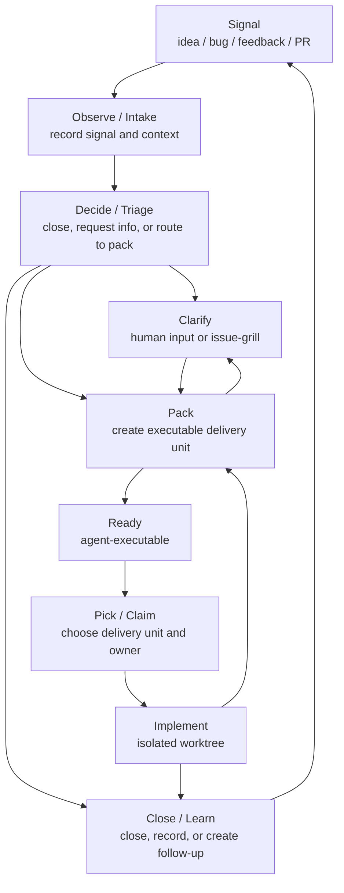

# AI-Native Development: Delivery Loop

## Purpose

AI-native development is a way to turn ambiguous signals into verified software changes.

Once agents can execute quickly, the main risk is no longer that nobody writes code. The larger risk is writing the wrong thing quickly and confidently. This workflow controls uncertainty: decide whether the work is worth doing, clarify the human decisions that matter, pack the work into an executable delivery unit, then close the loop through claim, implementation, review, and closure.

## The Problem

Most software work starts as a signal, not as a task:

- an idea;
- a bug report;
- user feedback;
- a screenshot or error message;
- a product judgment;
- an external PR;
- an unfinished design.

Those signals mix facts, value judgments, business rules, implementation risk, dependencies, and acceptance criteria. Jumping straight to implementation amplifies three failures:

- **Wrong problem**: building something that is not worth doing, already done, or pointed in the wrong direction.
- **Wrong boundary**: making the scope too large, too small, incorrectly split, or dependency-blind.
- **Wrong completion standard**: writing code without a way to prove it satisfies the real need.

AI-native development solves these failures with an explicit loop.

## Core Loop

```text
Observe -> Decide -> Clarify -> Pack -> Claim -> Implement -> Close/Learn
```

Each stage reduces a different kind of uncertainty:

| Stage | Question | Main output |
| --- | --- | --- |
| Observe | What signal did we receive? What facts are already known? | Raw request, context, reproduction clues, evidence |
| Decide | Is it worth acting on? What is missing? | Close reason, information request, or pack route |
| Clarify | Which human decision blocks a correct package? | Recorded decision, documentation proposal, or specific unanswered question |
| Pack | What is the executable delivery unit? | Single issue package or PRD package |
| Claim | Who owns this delivery unit now? | Assignee, claim comment, or claim receipt |
| Implement | What code change satisfies the package? | Code, tests, verification, PR, or commit |
| Close/Learn | How does the result close? What should be recorded? | Closed work, docs, follow-up work |

This is a loop, not a one-way assembly line. Any stage can discover that an earlier assumption was wrong:

- Packing finds a missing human decision: route to Clarify.
- Implementation finds a spec error: route back to Pack or Clarify.
- Review or acceptance fails: return to Implement or Pack.
- The work is already done, duplicated, or rejected: close it.

## Human And Agent Responsibilities

Humans should not be the bottleneck for every step. Agents should not make human value judgments on their own.

| Participant | Responsible for |
| --- | --- |
| Human | Value judgments, business tradeoffs, authorization, external access, acceptance, merge, rejection |
| Agent | Fact-finding, reproduction, context synthesis, packaging, implementation, tests, consistency audits |
| Workflow state backend / Docs | Durable state, specs, relationships, decisions, and completion evidence |

Principles:

- Humans enter only when judgment, authorization, or acceptance is required.
- Agents should first look for facts in code, tests, logs, docs, and the configured workflow state backend.
- Every executable delivery unit should have a clear boundary and verification path.
- When execution proves the package wrong, do not privately expand the scope; route the work back to Pack or Clarify.
- Requirements, acceptance, child slices, relationships, state reasons, and blockers belong in the configured workflow state backend. Chat output is a receipt, not a second specification.
- Human decisions should be made once at the right stage. Clarification confirms decisions; later stages consume them.
- A skill should refuse and route back when its preconditions are missing, rather than improvising the missing upstream work.
- Normal backend writes are part of the invoked stage. Stop for confirmation only when the write introduces unconfirmed judgment, overrides ownership, closes work, releases a claim, or mutates an ambiguous target.
- Implementation starts from the configured workflow state backend in an isolated branch or worktree.

## Design Balances

Use these balances when changing workflow behavior, skill instructions, backend rules, stage states, confirmation points, or user-visible output. The goal is not to maximize either side. The goal is to keep the delivery loop effective without making it rigid, noisy, unsafe, or over-specified.

### Result Correctness vs Delivery Throughput

- **Problem value**: make sure the work is worth doing, not duplicated, and pointed in the right direction.
- **Delivery boundary**: make sure the delivery unit is neither too large, too small, incorrectly split, nor mixed with unrelated work.
- **Completion standard**: make sure acceptance criteria, verification path, and completion evidence are clear enough to prevent "looks done" implementations.

### Agent Initiative vs Human Authority

- **Agent-owned facts**: agents should verify code, tests, logs, docs, existing work records, and backend state before asking a human.
- **Human-owned judgment**: product tradeoffs, authorization, rejection, acceptance, merge, and risk acceptance require human authority.
- **Confirmation boundary**: normal stage writes do not need repeated approval; confirmation is reserved for unconfirmed judgments, ownership overrides, closing work, releasing claims, or ambiguous mutation targets.

### Source of Truth Sufficiency vs Attention Cost

- **Complete backend specification**: requirements, acceptance, relationships, blockers, child slices, and the Package Contract belong in the configured workflow state backend.
- **Short human receipts**: chat output should say what changed, where the work is now, and what happens next, not copy the full specification.
- **Single authoritative expression**: maintain one source for each durable rule or fact, then link to it instead of repeating it across docs, skills, and backend references.

### Recoverability / Auditability vs State Noise

- **Evidence for turning points**: triage, grill decisions, package publication, claim, implementation, review, verification, and closure need durable evidence.
- **Current-state recovery**: the backend should make the current stage, blocker, owner, and next skill recoverable without reading the whole chat.
- **No durable scratchpad**: temporary reasoning, guesses, drafts, and question-by-question interview notes should not be persisted unless they become decisions, blockers, or completion evidence.

### System Invariants vs Scenario Flexibility

- **Hard invariants**: keep one workflow backend, claim only delivery units, preserve claim scope, keep PRD children out of public claim queues, and implement from the backend source of truth.
- **Soft strategies**: output length, explanation depth, candidate ranking, and lightweight package shape can adapt to the work.
- **Routable exceptions**: small fixes, existing PRs, urgent work, and incomplete inputs should route to the right stage instead of forcing the current skill to complete.

### Skill Economy vs Behavioral Predictability

- **Behavior-changing text**: keep rules that change agent behavior; remove no-ops, duplicated explanations, stale sediment, and defensive prose that does not affect execution.
- **Visible safety constraints**: keep completion criteria, source-of-truth rules, blocked routes, claim scope, and other safety constraints visible in `SKILL.md` when hiding them would make agents drift.
- **Progressive disclosure**: keep always-used process in the skill body; move backend mechanics, long templates, and branch-specific reference to the backend contract or sibling references.

### Ownership Integrity vs Parallel Execution

- **Complete public claim unit**: claim a single issue package as itself, or claim a PRD package as the parent plus all children.
- **Internal execution slices**: child slices should be clear enough for the package owner to delegate or parallelize internally.
- **Undivided integration responsibility**: even when child slices run in parallel, the package owner remains responsible for integration, verification, and closure.

### Unified Abstraction vs Native Backend Experience

- **Shared concepts**: work record, delivery unit, stage state, State Reason, Package Contract, relationships, ownership, receipts, and lifecycle outcomes mean the same thing across backends.
- **Native representation**: GitHub-native should use issues, labels, native relationships, comments, and assignees; markdown-file-based should use `.and/work`, frontmatter, and receipt files.
- **No dual-track state**: the selected backend is the only workflow state source. Do not create markdown shadow state for GitHub-native or GitHub mirrors for markdown-file-based.

## End-To-End Flow



Flow rules:

1. **Observe / Intake** records the signal without rushing into solution design.
2. **Decide / Triage** decides whether the work should close, wait for information, or be packed.
3. **Clarify** contains human input that must be resolved before a correct package can be created. Use `issue-grill` when a structured decision interview is needed.
4. **Pack** turns worth-doing work into exactly one executable delivery unit. It synthesizes resolved decisions and publishes normal package backend edits; it does not reopen the clarification interview.
5. **Ready** means an implementation agent can begin blocker and claim checks.
6. **Pick / Claim** identifies the delivery unit and current owner. Pick should do the full evidence check but report a concise recommendation.
7. **Implement** uses `issue-implement` on the claimed delivery unit in an isolated branch or worktree.
8. **Close / Learn** closes the work and records docs, out-of-scope decisions, or follow-up work when needed.

## Delivery Units

Before implementation, work must be packed into one delivery unit. The package can be concise, but it must tell the implementation agent:

- current behavior;
- desired behavior;
- user stories or stakeholder value;
- out of scope;
- key interfaces, domain concepts, or constraints;
- the testing seam or verification strategy;
- acceptance criteria and how completion will be verified.

The package is the implementation contract. Earlier issues, comments, receipts, and discussion are context.

Delivery unit shapes:

- **Single issue package**: one work record with the complete Package Contract and `ready-for-agent`; no child records are created.
- **PRD package**: one parent PRD with the complete Package Contract and child records for internal execution, progress, ordering, delegation, and acceptance tracking.

Both shapes require the same contract strength. The difference is whether the work needs child slices.

Do not treat file paths and line numbers as the specification itself. They become stale; behavior, interfaces, constraints, and acceptance criteria are more durable.

## Workflow State Backend

Each repository chooses one authoritative workflow state backend in `.and/config.yml`:

```yaml
version: 1
workflow_state_backend: github-native
```

or:

```yaml
version: 1
workflow_state_backend: markdown-file-based
```

Version 1 config has exactly `version` and `workflow_state_backend`. Backend policy, label names, claim rules, branch conventions, and storage details belong in the backend contract, backend references, or workflow skills.

Use [AI-native backend contract](../ai-native-backend-contract/SKILL.md) before changing backend behavior. The supported backend references are:

- [GitHub-native backend](../ai-native-backend-contract/backends/github-native.md);
- [Markdown-file-based backend](../ai-native-backend-contract/backends/markdown-file-based.md).

The backend is the source of truth for delivery-loop state. GitHub-native uses GitHub issues, labels, native relationships, comments, and assignees. Markdown-file-based uses `.and/work` and does not use GitHub issues as a discussion, notification, mirror, or synchronization surface. Branches, commits, pull requests, CI, and reviews are implementation artifacts referenced by workflow state; they do not carry workflow state themselves.

Keep four kinds of information separate in any backend:

| Information | Representation | Purpose |
| --- | --- | --- |
| Stage state | Backend stage-state representation | Shows which pre-execution stage a delivery unit is in. |
| Containment relationship | Backend containment representation | Shows how a PRD package is sliced. |
| Dependency relationship | Backend dependency representation | Shows execution order between work records. |
| Ownership | Backend ownership representation | Shows who is working on which delivery unit. |

Use each backend mechanism for one purpose. Do not maintain parallel GitHub issue state and markdown-file workflow state.

## Stage State

Each delivery unit should have at most one public stage state. PRD child slices inherit the parent PRD delivery unit's stage state and are not picked independently.

| State | Stage | Meaning |
| --- | --- | --- |
| `needs-triage` | Decide | The routing decision has not been completed. |
| `needs-info` | Clarify | Human, reporter, maintainer, external-system, or manual acceptance input is missing. |
| `needs-pack` | Pack | The work is worth doing but is not yet packaged as an executable delivery unit. |
| `ready-for-agent` | Ready | The single issue package or PRD package has an executable package and can be picked after blocker and claim checks. |

Closed work uses a lifecycle outcome, not an active stage state. The backend reference defines how completion evidence is recorded.

Keep this queue small. Add another public stage state only when the repository has a real queue with a clear owner, entry condition, and exit condition.

### State Reason

`needs-info` is one stage state with a structured State Reason. Do not split it into separate stage states until the repository has separate real queues with different owners.

Every current `needs-info` route should include a latest State Reason:

```markdown
## State Reason

State: needs-info
Cause: <missing-facts, decision-needed, access-needed, external-state, or acceptance-needed>
Owner: <reporter, maintainer, human, agent, or external-system>
Question: <one specific question, decision, permission, external event, or acceptance gate>
Resume with: <issue-triage, issue-grill, or issue-pack>
Exit criteria: <what must be true before this delivery unit can leave needs-info>
```

Use `Cause` to describe why the delivery unit is waiting, `Owner` to show who can unblock it, `Question` to make the next action concrete, `Resume with` to name the workflow skill to run after the owner supplies input, and `Exit criteria` to prevent partial answers from looking complete.

State Reason history is append-only. When the reason materially changes, append a new comment or receipt instead of deleting the old one. A backend may also keep the latest State Reason in queryable metadata; the latest State Reason supersedes earlier State Reasons.

## Pack And Dependencies

Large work should be expressed as a PRD package: one parent PRD plus child records that track vertical slices. The PRD package is the delivery unit.

Pack rules:

- `issue-pack` is the only workflow skill that creates `ready-for-agent` delivery units.
- Use the configured backend's parent PRD marker for the parent work record.
- A parent PRD can carry `ready-for-agent`; that means the whole PRD package is ready to pick, claim, and implement.
- Child records are independently-grabbable tracer-bullet slices inside the PRD package. A claiming agent may delegate them to subagents while keeping one owner for the package.
- Do not mark PRD children `ready-for-agent`; they are not independent pick targets.
- If a slice should be independently picked by another agent, make it a standalone issue rather than a PRD child.
- Do not duplicate the configured containment relationship with a second representation.

Dependency rules:

- A dependency relationship expresses execution order only.
- If child B must wait for child A inside the same PRD package, set B as blocked by A. That internal order does not block picking the parent PRD package.
- Do not make a parent PRD the blocker for its children merely because it is the parent.
- Cross-PRD dependencies use the configured dependency relationship, not fake containment links.
- A delivery unit with an open external blocker is not pickable.

## Claim Rules

The claim unit must equal the delivery unit.

- A single issue package with `ready-for-agent` can be claimed.
- A parent PRD with `ready-for-agent` is claimed as the whole PRD package: parent plus all children.
- PRD children cannot be claimed separately through the public workflow backend.
- The parent PRD owner may use child records as internal subagent work units, but remains responsible for integration, verification, and closure of the whole package.
- A delivery unit with an open external blocker cannot be claimed.
- If the delivery unit is unclear, move the work back to `needs-pack`.

Recommended claim signals:

- backend ownership record;
- assignee when the backend supports it;
- claim comment or receipt.

Implementation artifact links can be attached after ownership is recorded, but they do not establish ownership by themselves.

Claims must not quietly change scope. If execution discovers that the package is wrong, route the work back to `needs-pack` or to `needs-info` with a State Reason.

## Roles And Skills

These are workflow roles, not necessarily separate people or separate agents. One agent may perform multiple roles, but it should respect the boundary of the role it is currently performing.

| Role | Input | Output |
| --- | --- | --- |
| Intake | Raw signal | Durable work item, usually entering `needs-triage`. |
| Triage | `needs-triage`, or `needs-info` with new input | Lifecycle outcome, `needs-info` with a State Reason, or `needs-pack`. |
| Clarify | `needs-info` caused by missing decisions | Recorded human decision, documentation proposals, or current State Reason via `issue-grill`. |
| Pack | `needs-pack`, or clarified work | Single issue package or PRD package. |
| Pick | `ready-for-agent` delivery units | Recommended single issue package or PRD package. |
| Claim | Picked delivery unit | Recorded ownership and confirmed claim scope. |
| Implement | Claimed delivery unit | Implemented, verified, reviewed, and committed in an isolated worktree. |
| Sweep | Active work set | Stale claims, incorrect state, incorrect relationships, and parent PRDs needing follow-up. |

Skill directions:

- `issue-intake`: record requests only; do not triage or pack.
- `issue-triage`: make routing decisions; do not create packages.
- `issue-grill`: run the decision interview and record backend-safe packaging input; do not edit local docs.
- `issue-pack`: create the executable delivery unit; route to `issue-grill` when human decisions block packaging.
- `issue-pick`: choose work read-only; do not mutate the backend.
- `issue-claim`: perform the ownership side effects and point to `issue-implement`.
- `issue-implement`: execute the claimed delivery unit in an isolated worktree from the configured backend source of truth.
- `issue-sweep`: audit state, claim, and relationship drift.
- `ask-andie`: recommend the next skill from the current state and context.

## Invariants

All related skills must maintain these invariants:

- A raw signal cannot jump to implementation unless it has been packed.
- `issue-triage` does not create `ready-for-agent` work.
- Missing human judgment, external access, or acceptance input should route to `needs-info`.
- `needs-info` must carry a current State Reason.
- `needs-pack` means packaging can continue, but implementation should not start.
- `ready-for-agent` means only blocker and claim checks are needed before implementation.
- A delivery unit has at most one public stage state.
- Parent PRD plus `ready-for-agent` means the PRD package is executable as a whole.
- PRD children are not independent pick or claim targets, but may be internal implementation units under the parent PRD owner.
- An open external blocker makes a delivery unit not pickable.
- Claim scope must cover the full delivery unit.
- Implementation must not happen in a shared dirty worktree or from chat summaries.
- When the package is wrong, route back to `needs-pack` or to `needs-info` with a State Reason instead of privately changing scope.

## Update Triggers

Update this document when:

- an issue-related skill is added or changed;
- the stage-state set changes;
- the claim mechanism changes;
- backend capabilities or conventions change;
- the repository promotes a non-state concept into a state label;
- the same kind of misrouting, misclaim, or relationship drift happens repeatedly.
