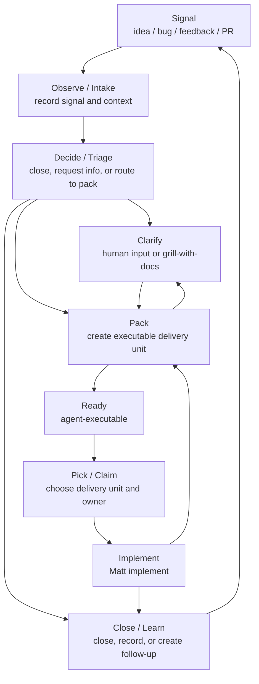

# AI-Native Development: Delivery Loop

## Purpose

AI-native development is a way to turn ambiguous signals into verified software changes.

Once agents can execute quickly, the main risk is no longer that nobody writes code. The larger risk is writing the wrong thing quickly and confidently. This workflow controls uncertainty: decide whether the work is worth doing, clarify the human decisions that matter, pack the work into an executable delivery unit, then close the loop through claim, implementation, review, and closure.

## The Problem

Most software work starts as a signal, not as a task:

- an idea;
- a bug report;
- user feedback;
- a screenshot or error message;
- a product judgment;
- an external PR;
- an unfinished design.

Those signals mix facts, value judgments, business rules, implementation risk, dependencies, and acceptance criteria. Jumping straight to implementation amplifies three failures:

- **Wrong problem**: building something that is not worth doing, already done, or pointed in the wrong direction.
- **Wrong boundary**: making the scope too large, too small, incorrectly split, or dependency-blind.
- **Wrong completion standard**: writing code without a way to prove it satisfies the real need.

AI-native development solves these failures with an explicit loop.

## Core Loop

```text
Observe -> Decide -> Clarify -> Pack -> Claim -> Implement -> Close/Learn
```

Each stage reduces a different kind of uncertainty:

| Stage | Question | Main output |
| --- | --- | --- |
| Observe | What signal did we receive? What facts are already known? | Raw request, context, reproduction clues, evidence |
| Decide | Is it worth acting on? What is missing? | Close reason, information request, or pack route |
| Clarify | Which human decision blocks a correct package? | Recorded decision, docs update, or specific unanswered question |
| Pack | What is the executable delivery unit? | Ordinary ready issue or PRD package |
| Claim | Who owns this delivery unit now? | Assignee, claim comment, branch, or PR link |
| Implement | What code change satisfies the package? | Code, tests, verification, PR, or commit |
| Close/Learn | How does the result close? What should be recorded? | Closed work, docs, follow-up work |

This is a loop, not a one-way assembly line. Any stage can discover that an earlier assumption was wrong:

- Packing finds a missing human decision: route to Clarify.
- Implementation finds a spec error: route back to Pack or Clarify.
- Review or acceptance fails: return to Implement or Pack.
- The work is already done, duplicated, or rejected: close it.

## Human And Agent Responsibilities

Humans should not be the bottleneck for every step. Agents should not make human value judgments on their own.

| Participant | Responsible for |
| --- | --- |
| Human | Value judgments, business tradeoffs, authorization, external access, acceptance, merge, rejection |
| Agent | Fact-finding, reproduction, context synthesis, packaging, implementation, tests, consistency audits |
| Tracker / Docs | Durable state, specs, relationships, decisions, and completion evidence |

Principles:

- Humans enter only when judgment, authorization, or acceptance is required.
- Agents should first look for facts in code, tests, logs, docs, and the tracker.
- Every executable delivery unit should have a clear boundary and verification path.
- When execution proves the package wrong, do not privately expand the scope; route the work back to Pack or Clarify.

## End-To-End Flow



Flow rules:

1. **Observe / Intake** records the signal without rushing into solution design.
2. **Decide / Triage** decides whether the work should close, wait for information, or be packed.
3. **Clarify** contains human input that must be resolved before a correct package can be created. Use `grill-with-docs` when a structured decision interview is needed.
4. **Pack** turns worth-doing work into exactly one executable delivery unit.
5. **Ready** means an implementation agent can begin blocker and claim checks.
6. **Pick / Claim** identifies the delivery unit and current owner.
7. **Implement** uses Matt `implement` on the claimed delivery unit.
8. **Close / Learn** closes the work and records docs, out-of-scope decisions, or follow-up work when needed.

## Delivery Units

Before implementation, work must be packed into one delivery unit. The package can be lightweight, but it must tell the implementation agent:

- current behavior;
- desired behavior;
- out of scope;
- key interfaces, domain concepts, or constraints;
- how completion will be verified.

Delivery unit shapes:

- **Ordinary issue**: one issue with an Agent Brief and `ready-for-agent`.
- **PRD package**: one parent PRD with child issues for progress, ordering, and acceptance tracking.

Do not treat file paths and line numbers as the specification itself. They become stale; behavior, interfaces, constraints, and acceptance criteria are more durable.

## Tracker Representation

The issue tracker is the default surface for externalizing the delivery loop. Keep four kinds of information separate:

| Information | Representation | Purpose |
| --- | --- | --- |
| Queue state | State labels | Shows which pre-execution stage a delivery unit is in. |
| Structural relationship | GitHub parent/sub-issue | Shows how a PRD package is sliced. |
| Execution dependency | GitHub blocked-by/blocking | Shows execution order between work items. |
| Ownership | Assignee, claim comment, branch, PR | Shows who is working on which delivery unit. |

Use each tracker mechanism for one purpose: queue labels for pre-execution routing, parent/sub-issue links for PRD package structure, blocked-by/blocking links for execution order, and ownership signals for active work.

## State Labels

Each delivery unit should have at most one queue state label. Delivery units are ordinary issues and parent PRDs. Child issues under a parent PRD inherit the parent PRD's queue state and are not picked independently.

| State | Stage | Meaning |
| --- | --- | --- |
| `needs-triage` | Decide | The routing decision has not been completed. |
| `needs-info` | Clarify | Human, reporter, maintainer, external-system, or manual acceptance input is missing. |
| `needs-pack` | Pack | The work is worth doing but is not yet packaged as an executable delivery unit. |
| `ready-for-agent` | Ready | The ordinary issue or PRD package has an executable package and can be picked after blocker and claim checks. |

Closed work uses the tracker lifecycle state, not a queue label. Use the closing comment, and close-reason labels only when the repository already has that convention.

Keep this queue small. Add another active queue label only when the repository has a real queue with a clear owner, entry condition, and exit condition.

## Pack And Dependencies

Large work should be expressed as a PRD package: one parent PRD plus child issues that track vertical slices. The PRD package is the delivery unit.

Pack rules:

- `issue-pack` is the only workflow skill that creates `ready-for-agent` delivery units.
- Use `parent-prd` as the structural label for the parent issue.
- A parent PRD can carry `ready-for-agent`; that means the whole PRD package is ready to pick, claim, and implement.
- Child issues are progress and acceptance slices inside the PRD package.
- Do not mark PRD children `ready-for-agent`; they are not independent pick targets.
- If a slice should be independently picked by another agent, make it a standalone issue rather than a PRD child.
- Do not duplicate the same sub-issues with a Markdown task list.

Dependency rules:

- A blocker expresses execution order only.
- If child B must wait for child A inside the same PRD package, set B as blocked by A. That internal order does not block picking the parent PRD package.
- Do not make a parent PRD the blocker for its children merely because it is the parent.
- Cross-PRD dependencies use blocked-by, not fake parent/sub-issue links.
- A delivery unit with an open external blocker is not pickable.

## Claim Rules

The claim unit must equal the delivery unit.

- A single `ready-for-agent` issue can be claimed.
- A `parent-prd` with `ready-for-agent` is claimed as the whole PRD package: parent plus all children.
- PRD children cannot be claimed separately.
- A delivery unit with an open external blocker cannot be claimed.
- If the delivery unit is unclear, move the work back to `needs-pack`.

Recommended claim signals:

- assignee;
- claim comment;
- linked branch or draft PR.

Claims must not quietly change scope. If execution discovers that the package is wrong, route the work back to `needs-pack` or `needs-info`.

## Roles And Skills

These are workflow roles, not necessarily separate people or separate agents. One agent may perform multiple roles, but it should respect the boundary of the role it is currently performing.

| Role | Input | Output |
| --- | --- | --- |
| Intake | Raw signal | Durable work item, usually entering `needs-triage`. |
| Triage | `needs-triage`, or `needs-info` with new input | Closed, `needs-info`, or `needs-pack`. |
| Clarify | `needs-info` caused by missing decisions | Recorded human decision; often via Matt `grill-with-docs`. |
| Pack | `needs-pack`, or clarified work | Ordinary ready issue or PRD package. |
| Pick | `ready-for-agent` delivery units | Recommended ordinary issue or PRD package. |
| Claim | Picked delivery unit | Recorded ownership and confirmed claim scope. |
| Implement | Claimed delivery unit | Hand off to Matt `implement`. |
| Sweep | Active work set | Stale claims, incorrect labels, incorrect relationships, closable parent PRDs. |

Skill directions:

- `issue-intake`: record requests only; do not triage or pack.
- `issue-triage`: make routing decisions; do not create packages.
- `issue-pack`: create the executable delivery unit; route to `grill-with-docs` when human decisions block packaging.
- `issue-pick`: choose work read-only; do not mutate the tracker.
- `issue-claim`: perform the ownership side effects and point to Matt `implement`.
- `issue-sweeper`: audit state, claim, and relationship drift.
- `ask-andie`: recommend the next skill from the current state and context.

## Invariants

All related skills must maintain these invariants:

- A raw signal cannot jump to implementation unless it has been packed.
- `issue-triage` does not create `ready-for-agent` work.
- Missing human judgment, external access, or acceptance input should route to `needs-info`.
- `needs-pack` means packaging can continue, but implementation should not start.
- `ready-for-agent` means only blocker and claim checks are needed before implementation.
- A delivery unit has at most one queue state label.
- `parent-prd` plus `ready-for-agent` means the PRD package is executable as a whole.
- PRD children are not independent pick, claim, or implementation targets.
- An open external blocker makes a delivery unit not pickable.
- Claim scope must cover the full delivery unit.
- When the package is wrong, route back to `needs-pack` or `needs-info` instead of privately changing scope.

## Update Triggers

Update this document when:

- an issue-related skill is added or changed;
- the state-label set changes;
- the claim mechanism changes;
- GitHub issue relationship capabilities or conventions change;
- the repository promotes a non-state concept into a state label;
- the same kind of misrouting, misclaim, or relationship drift happens repeatedly.
