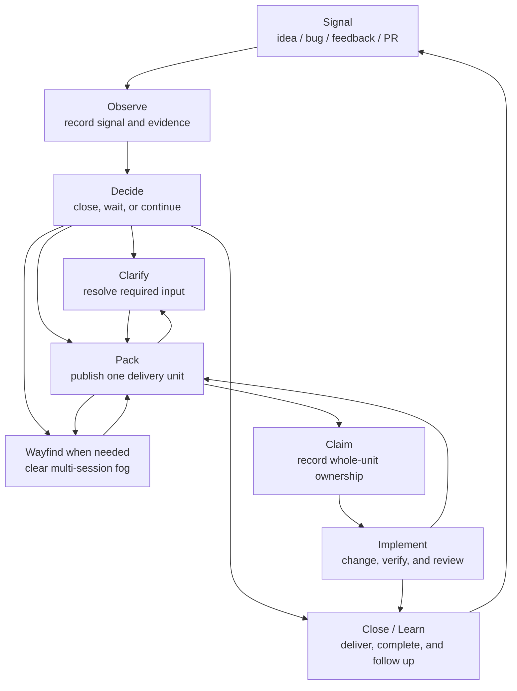

# AI-Native Development: Delivery Loop

## Purpose

AI-native development turns ambiguous signals into verified software changes.

Once Agents can execute quickly, the main risk is no longer that nobody writes code. The larger risk is writing the wrong thing quickly and confidently. The AND delivery loop controls that risk by reducing uncertainty before and during implementation.

## The Problem

Most software work begins as a signal rather than a defined delivery unit:

- an idea;
- a bug report;
- user feedback;
- a screenshot or error message;
- a product judgment;
- an external pull request;
- an unfinished design.

Those signals mix facts, value judgments, business rules, implementation risk, dependencies, and acceptance criteria. Jumping straight to implementation amplifies three failures:

- **Wrong problem**: building something that is not worth doing, is already done, or points in the wrong direction.
- **Wrong boundary**: making the work too large, too small, incorrectly split, or blind to real dependencies.
- **Wrong completion standard**: changing code without a way to prove it satisfies the need.

The loop separates these uncertainties so each is resolved by the right participant at the right time.

## Core Loop

```text
Observe -> Decide -> Clarify -> Pack -> Claim -> Implement -> Close/Learn
```

| Stage | Question | Main result |
| --- | --- | --- |
| Observe | What signal arrived, and what is already known? | A durable work record with source evidence. |
| Decide | Is this worth acting on, and what is missing? | Closure, a specific wait, or a route to packaging. |
| Clarify | Which bounded, currently enumerable decision space or other required input blocks a correct package? | Confirmed input or one explicit unresolved question. |
| Pack | What complete delivery unit can an Agent execute? | A single issue package or PRD package. |
| Claim | Who owns the whole delivery unit? | One recorded owner and an unchanged scope. |
| Implement | What change satisfies the package, what does it require at deployment time, and which worktree-owned local resources remain? | An isolated, verified, and reviewed implementation with a Deployment disposition and an optional typed Cleanup handoff. |
| Close/Learn | What proves delivery completion, which handed-off local resources were reclaimed, and what follows from it? | A lifecycle outcome, completion evidence, linked handoffs, verified typed cleanup when handed off, and any new signal. |

This is a loop rather than a one-way assembly line. A later stage can reveal that an earlier assumption was wrong, but the correction returns to the stage that owns it. Packaging does not improvise a missing product decision, and implementation does not privately rewrite the package.

Wayfinding is a conditional on-ramp before Pack, not another mandatory stage. Use it when the destination is visible but later questions cannot yet be enumerated without further investigation. It clears that fog as a shared investigation map; ordinary work still follows Clarify or goes directly to Pack.

## Human And Agent Collaboration

Humans should not be the bottleneck for facts an Agent can verify. Agents should not silently make decisions that require human authority.

| Participant | Owns |
| --- | --- |
| Human | Value judgments, business tradeoffs, authorization, acceptance, merge, rejection, and risk acceptance. |
| Agent | Fact-finding, reproduction, synthesis, packaging, implementation, verification, and consistency checks. |
| GitHub workflow state | Durable work, investigation maps, decisions, package contracts, relationships, ownership, and completion evidence. |

The collaboration follows a few practical rules:

- Agents investigate code, tests, logs, docs, and existing workflow state before asking for facts.
- Human decisions happen once at the stage that needs them; downstream work consumes the recorded result.
- Requirements and acceptance live in GitHub workflow state. Chat reports what happened and what comes next instead of becoming a second specification.
- A stage that lacks its preconditions returns the work to the stage that owns the missing input.

## End-To-End Flow


```mermaid
flowchart TD
  Signal["Signal<br/>idea / bug / feedback / PR"]
  Observe["Observe<br/>record signal and evidence"]
  Decide["Decide<br/>close, wait, or continue"]
  Clarify["Clarify<br/>resolve required input"]
  Wayfind["Wayfind when needed<br/>clear multi-session fog"]
  Pack["Pack<br/>publish one delivery unit"]
  Claim["Claim<br/>record whole-unit ownership"]
  Implement["Implement<br/>change, verify, and review"]
  Close["Close / Learn<br/>deliver, complete, and follow up"]

  Signal --> Observe
  Observe --> Decide
  Decide --> Close
  Decide --> Clarify
  Decide --> Wayfind
  Decide --> Pack
  Clarify --> Pack
  Wayfind --> Pack
  Pack --> Clarify
  Pack --> Wayfind
  Pack --> Claim
  Claim --> Implement
  Implement --> Pack
  Implement --> Close
  Close --> Signal
```

Clarification is conditional. Work that already contains every required input can move from Decide to Pack. Work that is duplicate, complete, rejected, or no longer relevant can close without entering implementation.

Wayfinding is also conditional. Its map and investigations are planning records, not delivery units: they cannot be picked or claimed for implementation. Once the map is clear, Pack publishes a separate delivery unit and keeps the completed map as linked planning evidence.

## Delivery Units

Implementation begins from one delivery unit with a complete behavioral contract and verification path:

- A **single issue package** carries the complete contract in one work record.
- A **PRD package** carries the complete contract on a parent plus child slices for internal progress, ordering, delegation, and acceptance tracking.

Both shapes require the same contract strength. The difference is whether child slices help execute and verify the work.

A PRD package is still claimed as one unit. Its owner may delegate child slices, but remains responsible for integration, verification, and closure. Containment describes package structure; dependency describes execution order. Neither replaces ownership of the complete delivery unit.

## Durable Handoffs

GitHub is the source of truth for the loop. It keeps the current work record, Wayfinding map when any, State Reason, Package Contract, relationships, owner, the reviewed-head-bound Deployment disposition and any Cleanup handoff, and evidence recoverable when sessions or Agents change.

Before implementation, work moves through a small queue: `needs-triage`, `needs-info`, `needs-pack`, and `ready-for-agent`. These states describe where pre-execution uncertainty remains; they are not implementation progress states. The [workflow contract](../and-workflow-contract/SKILL.md) defines their meaning, GitHub representation, and invariants.

Branches, commits, pull requests, CI, and reviews are implementation artifacts. They provide evidence about delivery, while GitHub Issues continue to hold the package, ownership, and lifecycle outcome.

The latest Implementation receipt always carries a lightweight Deployment disposition: `none` for no environment rollout, `standard` for a rollout fully covered by a named stable runbook, or `custom` when package-specific instructions are needed. Only `custom` adds a full Deployment Manifest covering environments, data or configuration changes, ordered actions, prerequisites, compatibility, recovery, and verification. Finish validates and links this handoff but does not execute deployment or treat pending environment rollout as incomplete code delivery.

The receipt carries a Cleanup handoff only when a supported worktree-owned local resource survives for Finish. Omit Cleanup when no owned resource remains; omission requires no cleanup identity or Docker (or other runtime) access. `required` carries only cleanup items whose type has shared ownership, deletion, and verification rules; Docker Compose projects and AND-labeled Docker objects are the initial supported types. After delivery becomes authoritative, Finish reclaims handed-off items before removing recovery-bearing source worktrees or branches. Local cleanup neither changes deployment classification nor proves an environment rollout.

Acceptance is an optional source-delivery gate. A pending pre-merge gate waits for its owner before merge; a declared post-merge gate enters Finish and waits only at source completion after the authorized merge. A post-merge source defect returns to `and-intake`; repair orchestration remains outside this source-delivery loop.

Each stage leaves only the durable evidence needed to continue the work. Temporary reasoning and interview transcripts stay out of long-lived state unless they become a decision, blocker, requirement, or completion result.

## Repository Knowledge

Clarify and Wayfind leave repository files unchanged while recording one repository knowledge disposition for each completed decision. `Required` names the durable updates a future implementation must apply; `None` gives the authority-test reason that no update is needed.

The authoritative home advances with delivery: the decision receipt before Pack, the Package Contract after Pack, and the merged repository document after delivery. Pack preserves source links, and Implement maps each Required item to the reviewed diff. A discovery that changes the disposition returns to the stage that owns it.

This keeps planning recoverable without publishing unclaimed decisions as project knowledge. See [Stage repository knowledge through delivery](adr/0002-stage-repository-knowledge-through-delivery.md) for the decision and tradeoff.

## Feedback And Completion

The loop preserves correctness by making route-backs explicit:

- A bounded decision space whose questions can be enumerated now returns to Clarify; uncertainty whose later questions depend on further investigation returns to Wayfind. Missing facts, permissions, acceptance inputs, and external events return to their accountable owner.
- A weak or incorrect delivery boundary returns to Pack.
- Contradictory or stale workflow state is repaired before claim or implementation.
- Failed implementation verification returns to Implement unless it exposes a package defect.
- A completed, duplicate, rejected, or superseded delivery unit receives a terminal lifecycle outcome with evidence.

For a reviewed implementation at a clear Finish boundary—no blocking pre-merge acceptance or a declared post-merge gate before source completion—`and-finish` is the Close/Learn action. It delivers the implementation through one authorized GitHub pull request, records completion on the delivery-unit issue, performs typed local cleanup only for an explicit required handoff, and only then cleans proven-safe Git delivery artifacts. Review remains part of implementation evidence rather than being rerun during finish.

Closure can produce a new signal: a follow-up requirement, a documentation need, a newly discovered bug, or a lesson that changes future packages. That signal starts another loop instead of quietly expanding the completed delivery unit.

When Finish evidence confirms concrete unfinished work after source completion, [Deferred Finish follow-up](../and-workflow-contract/deployment-handoff.md#deferred-finish-follow-up) is the handoff to that new loop; environment rollout is not an extra source-completion stage.

## Continue Reading

- Use the [skills guide](skills.md) to choose the next workflow skill.
- Use the [workflow contract](../and-workflow-contract/SKILL.md) for workflow-state concepts, GitHub representation, operations, and invariants.
- Read the [Wayfinding records ADR](adr/0001-separate-wayfinding-records-from-delivery-units.md) for the map-to-package boundary.
- Read the [repository knowledge ADR](adr/0002-stage-repository-knowledge-through-delivery.md) for the decision-to-document authority chain.
